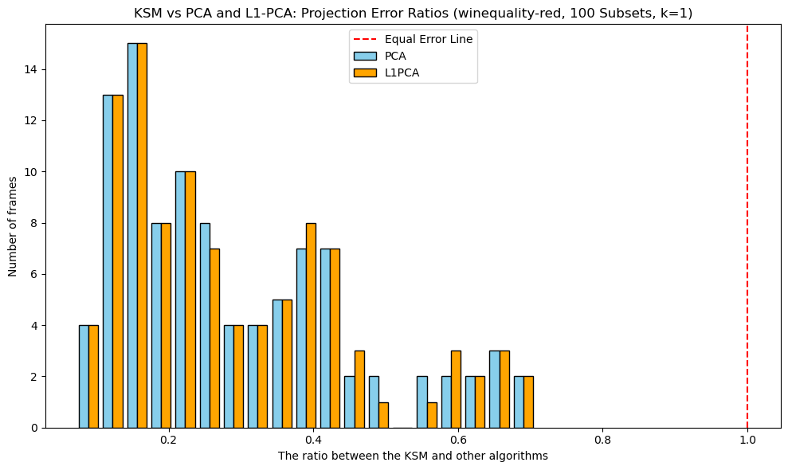

# 📘 KSM-Approximation-Project

This project implements and evaluates an efficient approximation algorithm for the **k-Subspace Median (KSM)** problem,  
based on *"An Efficient Approximation Algorithm for the k-Subspace Median Problem"* by **Daniel Greenhut** and **Dan Feldman**,Robotics & Big Data Labs, University of Haifa, Israel.

KSM offers a **robust alternative to PCA**, minimizing L2 distances (instead of squared distances),  
and is particularly useful when dealing with noise and outliers.
---

> ✅ Robust to Outliers & Noise  
> 💡 √d-Approximation via Convex Relaxation  
> 📊 Empirical Benchmark vs PCA and L1PCA  
> 🔬 Real-World Case Study (UCI Wine Dataset)

---
## 📊 Experimental Result Snapshot



> **Figure**: Histogram of projection error ratios (KSM vs PCA and L1PCA) over 100 random subsets of the UCI Wine dataset (k = 1).  
> Ratios below 1 indicate better performance of KSM. The figure shows that KSM consistently achieves lower error, demonstrating robustness.

---

## 📖 Background

Subspace approximation is a fundamental task in unsupervised learning and dimensionality reduction.  
The goal is to find a low-dimensional subspace that preserves the geometric structure of the data.

The most commonly used method is **Principal Component Analysis (PCA)**, which minimizes the sum of squared distances (ℓ₂² loss)  
between the data points and their projections. While PCA is computationally efficient and has a closed-form SVD solution,  
it is highly sensitive to outliers, as large deviations are penalized heavily.

**k-Subspace Median (KSM)**, in contrast, minimizes the sum of Euclidean distances (ℓ₂ loss) to the subspace.  
This makes it **more robust to noise and outliers**, but the problem is **non-convex and NP-hard** to optimize.

The algorithm introduced in the paper applies:
- ✅ **Convex relaxation (RL-KSM)** using SDP and SOCP
- ✅ **Spectral rounding** to recover feasible subspace
- ✅ A proven √d-approximation guarantee

---

## 🗂 Project Structure

```
KSM-Approximation-Project/
│
├── ksm/                  # Core algorithm implementation
│   ├── solver.py         # Convex relaxation (RL-KSM) and KSM algorithm
│   ├── utils.py          # Projection error, data loading, normalization
│   └── experiments.py    # Analysis & comparison (KSM vs PCA and L1PCA) utilities
│
├── external/             # L1PCA third-party repo (cloned from GitHub)
│   └── L1-Norm-Algorithms/... # L1PCA implementation
│
├── notebooks/
│   ├── ksm_approx_notebook.ipynb  # Full Jupyter notebook demo: synthetic + real data
│   └── README.md
│
├── tests/                # Unit tests (pytest)
│   ├── test_experiments.py
│   ├── test_solver.py
│   └── test_utils.py
│
├── wine+quality/         # Real dataset (UCI)
│   ├── winequality.names
│   └── winequality-red.csv
│
├── figures/              # Visual outputs
│
├── main.py               # CLI runner to analyze any dataset
├── setup_l1pca.py        # Helper script to clone and configure L1PCA repo
├── requirements.txt      # Required Python packages
└── README.md
```

---

## 🚀 Getting Started

1. Clone the repository:
```bash
git clone https://github.com/Anat-Ela/KSM-Approximation-Project.git
cd KSM-Approximation-Project
```

2. Install dependencies:
```bash
pip install -r requirements.txt
```
Make sure you have Python 3.8+ and cvxpy installed with a compatible solver (e.g. SCS or MOSEK)

3. (Recommended) Setup MOSEK Solver for CVXPY
    
    To solve the convex relaxation step of KSM (RL-KSM), the project uses the `MOSEK` solver,
    which provides accurate and efficient solutions for semidefinite programs (SDPs).

    If `MOSEK` is not available, the code automatically falls back to the default `SCS` solver. 

    To enable MOSEK:
    
   1. Install required packages:
        ```bash 
        pip install cvxpy "cvxpy[mosek]" mosek
        ```
   2. Get a free academic license:
       Visit the [MOSEK Academic License Portal](https://www.mosek.com/license/request/personal-academic/)and download your `mosek.lic` file.
   
   3. Place the license file:
      Save the `mosek.lic` file in your user license directory:
      - **On Linux/macOS:** `~/.mosek/mosek.lic`  
      - **On Windows:** `C:\Users\<YourName>\mosek\mosek.lic`
      
   Once installed and licensed, `cvxpy` will automatically use **MOSEK** when solving RL-KSM optimization problems.


4. (Optional) Setup for L1PCA Benchmarking:
    
   This project uses a third-party implementation of L1-PCA to benchmark against our KSM and PCA methods.

    To use it:
```bash
python external/setup_l1pca.py
```
> 🔗 **Alternatively**, you may clone it manually from:  
> [`https://github.com/ktountas/L1-Norm-Algorithms.git`](https://github.com/ktountas/L1-Norm-Algorithms.git)

---

## ▶️ Run the Analysis

To analyze a dataset using KSM, PCA, and L1PCA, simply run:
```bash
python main.py
```
By default, this will load the  `winequality-red.csv` dataset(UCI), perform subspace approximation with different values of k,
and generate projection error comparisons, including plots and statistics, comparing KSM vs PCA and L1PCA.

You can modify the dataset or parameters by editing the function call at the bottom of `main.py`:
```python
if __name__ == "__main__":
    main(
        filepath="./wine+quality/winequality-red.csv",
        target_col="quality",
        sep=";",
        k_values=[1, 2]
    )
```
⚠️ **Important**: The code currently supports only CSV files that:
- Contain numeric features only
- Include a column to be excluded (e.g., a target column)
- Have no missing values or non-numeric entries

✅ If you want to include L1PCA in the comparison, make sure to run setup_l1pca.py beforehand.

---

## 🧪 Run Unit Tests

The `tests/` folder contains unit tests for the main components of the project:  
`solver`, `utils`, and `experiments`.

To run all tests using `pytest`, simply run the following command from the project root:
```bash
python -m pytest tests/
```
The `tests/` folder contains unit tests for the core components of the project:  
`solver`, `utils`, and `experiments`.

To run all tests using **pytest**, open a terminal in the project root and run:

✅ Tip: Make sure all dependencies are installed (including pytest). You can install pytest using:
```python
pip install pytest
```
You should see output showing which tests passed or failed.

Test coverage includes:
- ✅ RL-KSM and exact KSM correctness on synthetic data
- ✅ Projection error computation
- ✅ Statistical validity of error comparisons (KSM vs PCA/L1PCA)

---

## 📓 Jupyter Notebook Demo

See [`notebooks/ksm_approx_notebook.ipynb`](notebooks/ksm_approx_notebook.ipynb) for a full interactive demo.

The notebook includes:

- 🎯 **Visual demo of the KSM-APPROX algorithm** on a synthetic 2D example  
- 📊 **Real-world data experiment** using the UCI Wine Quality dataset 

> A separate [Notebook README](notebooks/README.md) provides a detailed walkthrough.

---

## ✅ Project Summary: Goals & Contributions

This project bridges theoretical optimization with hands-on experimentation.  
We implemented and evaluated the **KSM-APPROX** algorithm, a √d-approximation to the **k-subspace median** problem, as proposed in Greenhut & Feldman's paper.

Key contributions include:

- 🧮 **Full RL-KSM implementation** using CVXPY with SDP and SOCP constraints.
- 🧩 **Spectral rounding procedure** based on eigen-decomposition.
- 🔬 **Visual demonstration** of the algorithm in 2D.
- 📊 **Empirical comparison** vs. PCA and L1PCA on real and synthetic data.
- 📈 **Statistical analysis** of projection errors across multiple random subsets.
- 📦 **Reproducible, modular code** with Jupyter demos and CLI pipeline.

> For more details see [`notebooks/README.md`](notebooks/README.md). 

---

## 🙌 Acknowledgements

This project was completed as part of the course **"Optimization for Machine Learning"**,  
taught by **Prof. Dan Feldman** at the University of Haifa.

It is based on the (yet unpublished) manuscript:  
**"An Efficient Approximation Algorithm for the k-Subspace Median Problem"**  
by **Daniel Greenhut** and **Dan Feldman**,  
**Robotics & Big Data Labs**, University of Haifa, Israel.

We thank the authors — and especially Prof. Feldman — for making this research available during the course.  
Their theoretical and algorithmic contributions provided the foundation for the implementation and experiments in this project.

We also thank:

- [**ktountas/L1-Norm-Algorithms**](https://github.com/ktountas/L1-Norm-Algorithms)  
  for the open-source ℓ₁-PCA implementation used in our benchmark comparisons.

  This implementation is based on the algorithm introduced in:

  > P. P. Markopoulos, G. N. Karystinos, and D. A. Pados,  
  > *“Optimal algorithms for ℓ₁-subspace signal processing,”*  
  > IEEE Transactions on Signal Processing, vol. 62, no. 19, pp. 5046–5058, 2014.

  We used the official `l1pca_sbfk_v0.py` implementation from the repository,  
  executed in a Jupyter Notebook environment for reproducibility.


- [**MOSEK Optimization Suite**](https://www.mosek.com/)  
  for providing an academic license used to solve SDP formulations in our CVXPY-based implementation.

- [**ChatGPT**](https://chat.openai.com/) & [**Perplexity.ai**](https://www.perplexity.ai/)  
  for technical assistance with Python code, mathematical formulations, and dataset exploration.

> All third-party tools were used in accordance with their respective academic/open-source licenses.

---

## 📄 License

This project is licensed under the **MIT License**.

